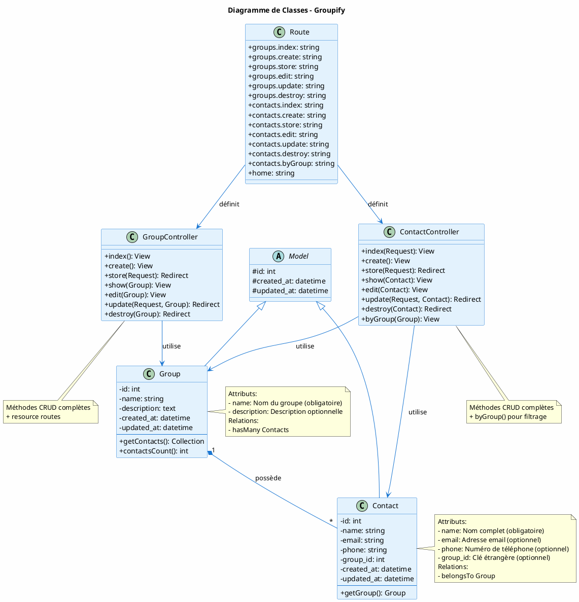

```plantuml
@startuml
' ============================================
' DIAGRAMME DE CLASSES (Class Diagram)
' ============================================

@startuml Groupify - Diagramme de Classes

skinparam classAttributeIconSize 0
skinparam backgroundColor #FEFEFE
skinparam classBackgroundColor #E3F2FD
skinparam classBorderColor #1976D2
skinparam arrowColor #1976D2

title Diagramme de Classes - Groupify

abstract class Model {
    # id: int
    # created_at: datetime
    # updated_at: datetime
}

class Group {
    - id: int
    - name: string
    - description: text
    - created_at: datetime
    - updated_at: datetime
    --
    + getContacts(): Collection
    + contactsCount(): int
}

class Contact {
    - id: int
    - name: string
    - email: string
    - phone: string
    - group_id: int
    - created_at: datetime
    - updated_at: datetime
    --
    + getGroup(): Group
}

class GroupController {
    + index(): View
    + create(): View
    + store(Request): Redirect
    + show(Group): View
    + edit(Group): View
    + update(Request, Group): Redirect
    + destroy(Group): Redirect
}

class ContactController {
    + index(Request): View
    + create(): View
    + store(Request): Redirect
    + show(Contact): View
    + edit(Contact): View
    + update(Request, Contact): Redirect
    + destroy(Contact): Redirect
    + byGroup(Group): View
}

class Route {
    + groups.index: string
    + groups.create: string
    + groups.store: string
    + groups.edit: string
    + groups.update: string
    + groups.destroy: string
    + contacts.index: string
    + contacts.create: string
    + contacts.store: string
    + contacts.edit: string
    + contacts.update: string
    + contacts.destroy: string
    + contacts.byGroup: string
    + home: string
}

' Relations d'héritage
Model <|-- Group
Model <|-- Contact

' Relations d'association
Group "1" *-- "*" Contact : possède

GroupController --> Group : utilise
ContactController --> Contact : utilise
ContactController --> Group : utilise

Route --> GroupController : définit
Route --> ContactController : définit

' Notes
note right of Group
  Attributs:
  - name: Nom du groupe (obligatoire)
  - description: Description optionnelle
  Relations:
  - hasMany Contacts
end note

note right of Contact
  Attributs:
  - name: Nom complet (obligatoire)
  - email: Adresse email (optionnel)
  - phone: Numéro de téléphone (optionnel)
  - group_id: Clé étrangère (optionnel)
  Relations:
  - belongsTo Group
end note

note bottom of GroupController
  Méthodes CRUD complètes
  + resource routes
end note

note bottom of ContactController
  Méthodes CRUD complètes
  + byGroup() pour filtrage
end note
@enduml
```
